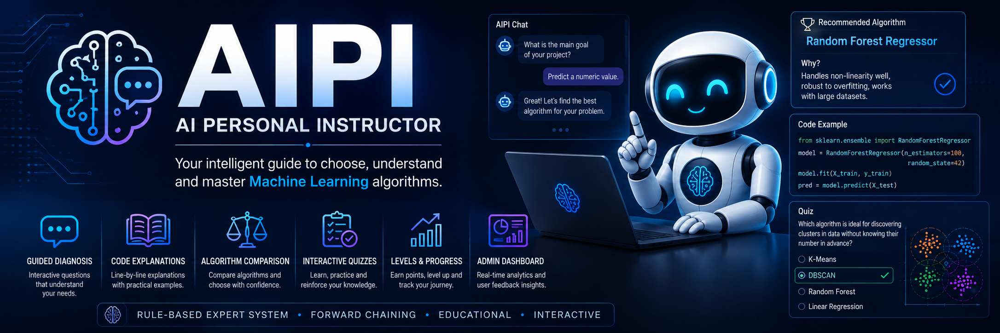

<p align="center">
  
</p>

# 🧠 AIPI – AI Personal Instructor

> **An Educational Expert System for Machine Learning Algorithm Selection**


---

# 📖 Overview

AIPI (**AI Personal Instructor**) is an educational **Expert System** developed using **Python** and **Flask** to assist students and developers in selecting the most appropriate **Machine Learning algorithm** for a given problem.

Unlike a traditional decision tree, AIPI acts as an **intelligent tutor**. It not only recommends an algorithm but also explains **why** it is the best option through:

- Interactive guided diagnosis
- Rule-based inference (Forward Chaining)
- Code examples
- Line-by-line explanations
- Algorithm comparisons
- Interactive quizzes

The objective is to help users understand Machine Learning concepts while improving their decision-making skills.

---

# 📸 Application Preview

> *(Replace the following images with screenshots of your application.)*

## Home Page


---

## Chat Interface


---

## Recommendation Example


---

## Quiz Module


---

## Administration Dashboard


---

# ✨ Features

## 🎓 Educational Module

- Interactive diagnosis through guided questions.
- Rule-based recommendation system using Forward Chaining.
- Line-by-line explanation of generated code.
- Technical comparison between recommended algorithms.
- Interactive quizzes for knowledge reinforcement.

---

## 🧠 Knowledge Base

The expert system currently includes:

### Regression

- Lasso Regression
- Support Vector Regression (SVR)
- SGD Regressor

### Classification

- Naive Bayes
- Linear SVC
- K-Nearest Neighbors (KNN)
- Random Forest

### Clustering

- K-Means
- DBSCAN

---

## 🎮 Gamification

- User level progression
- Multiple conversations
- Persistent chat history
- Automatic progress saving
- Hard Reset option

---

## 📊 Administration Dashboard

Administrators can monitor:

- User satisfaction
- Likes and dislikes
- Recommendation statistics

Accessible through:

```
/admin
```

---

# 🏗️ System Architecture

```text
                    User
                      │
                      ▼
             Flask Web Interface
                      │
                      ▼
             Inference Engine
                      │
                      ▼
             Knowledge Base
                      │
                      ▼
          Algorithm Recommendation
                      │
          ┌───────────┴───────────┐
          ▼                       ▼
   Educational Module       Interactive Quiz
```

---

# 🗂️ Project Structure

```text
AIPI/
│
├── app.py
├── knowledge_base.py
├── requirements.txt
├── README.md
├── LICENSE
│
├── templates/
│   ├── index.html
│   └── admin.html
│
├── static/
│   ├── style.css
│   └── image/
│
└── screenshots/
```

---

# 🛠️ Technologies

### Programming Language

- Python

### Framework

- Flask

### Machine Learning

- Scikit-Learn

### Frontend

- HTML5
- CSS3
- JavaScript

---

# 🚀 Installation

## Clone the repository

```bash
git clone https://github.com/ketzelG-22310245/AIPI-AI-Personal-Instructor-.git
cd AIPI-AI-Personal-Instructor-
```

---

## Create a virtual environment

### Windows

```bash
python -m venv venv
venv\Scripts\activate
```

### Linux / macOS

```bash
python3 -m venv venv
source venv/bin/activate
```

---

## Install dependencies

```bash
pip install -r requirements.txt
```

---

## Run the application

```bash
python app.py
```

---

## Open your browser

```
http://127.0.0.1:5000
```

Administration Dashboard

```
http://127.0.0.1:5000/admin
```

---

# 🎯 Future Improvements

- Add more Machine Learning algorithms.
- User authentication.
- Database integration.
- Cloud deployment.
- LLM integration for personalized tutoring.
- Docker containerization.
- User analytics dashboard.
- Export learning reports.

---

# 📄 License

This project is licensed under the **MIT License**.

See the LICENSE file for more information.

---

# 👨‍💻 Author

**Ketzel Gibran Carrillo Ibarra**

Mechatronics Engineering Student

Centro de Enseñanza Técnica Industrial (CETI)

Interested in:

- Robotics
- Embedded Systems
- Artificial Intelligence
- Control Systems
- Research & Development

---

# ⭐ Support

If you found this project useful, consider giving it a ⭐ on GitHub.